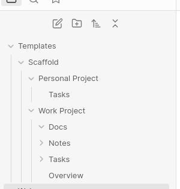
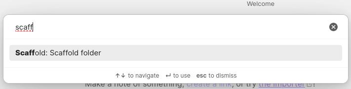
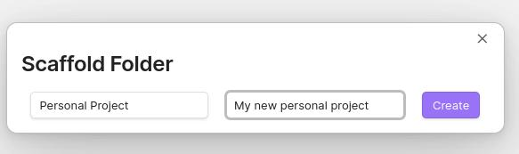
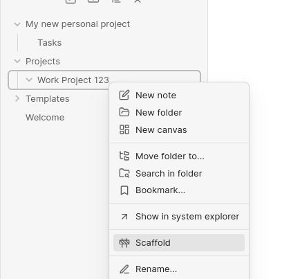
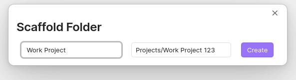
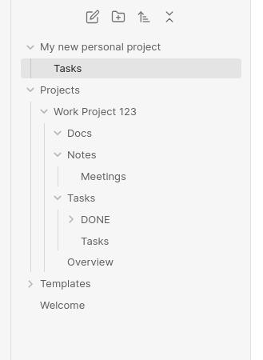

# Obsidian Scaffold Plugin

This is a simple plugin for [Obsidian](https://obsidian.md) that allows you to populate a folder with a set of files and folders. I.e. a scaffold.

## Installation

1. Download the `main.js` and `manifest.json` files from the latest release.
2. Copy them into your Obsidian vault's `.obsidian/plugins/obsidian-scaffold` folder.
3. Reload Obsidian.
4. Enable the plugin in the settings.
5. Go to the settings of the plugin and set the path to the folder where you want to store your scaffolds.

## Usage

### Create scaffolds

Create folders and files in the folder you set in the settings. These will be the scaffolds you can use to populate other folders.

### Run from the command palette

Open the command palette (`Cmd/Ctrl + P`), type `Scaffold` and select the `Scaffold: Scaffold folder` command.

Select the scaffolding you want to use from the list and enter the name of the folder where you want to create the scaffold.

Finally click create and the scaffold will be created in the folder you specified.

### Run from the context menu

Right click on a folder in the file explorer and select the `Scaffold` option.

Select the scaffolding you want to use from the list and verify the name of the folder where you want to create the scaffold.

Finally click create and the scaffold will be created in the folder you specified.

### Result

The folder you selected will be populated with the files and folders from the scaffold you selected.

